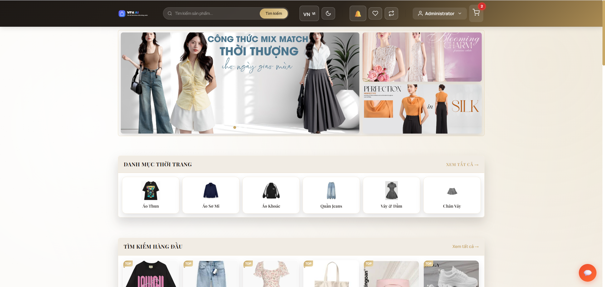
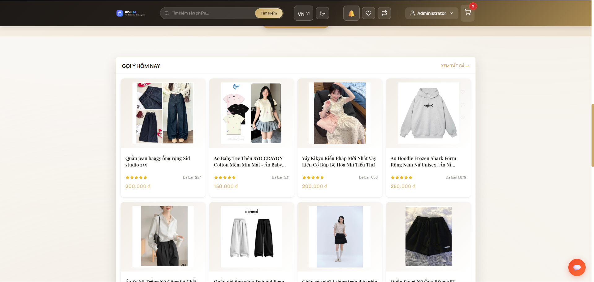
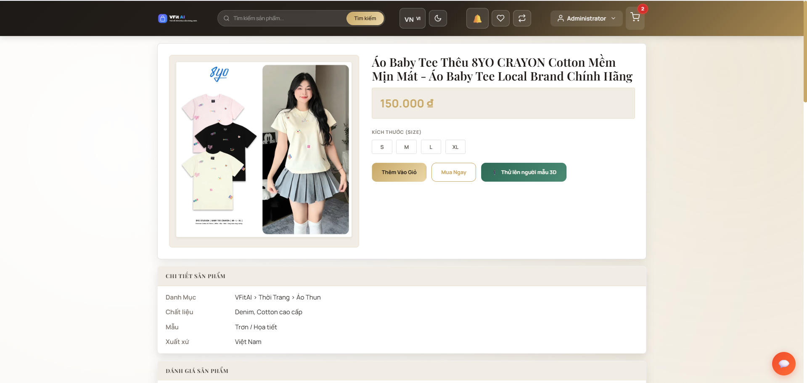
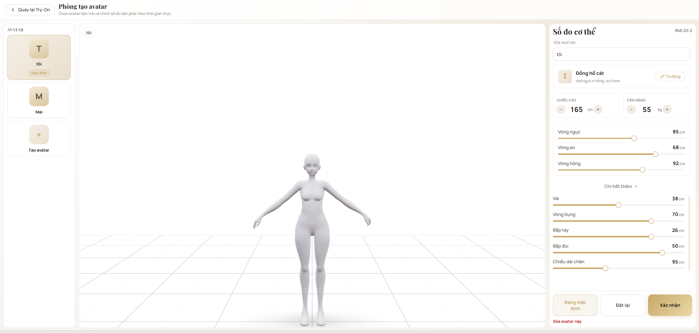
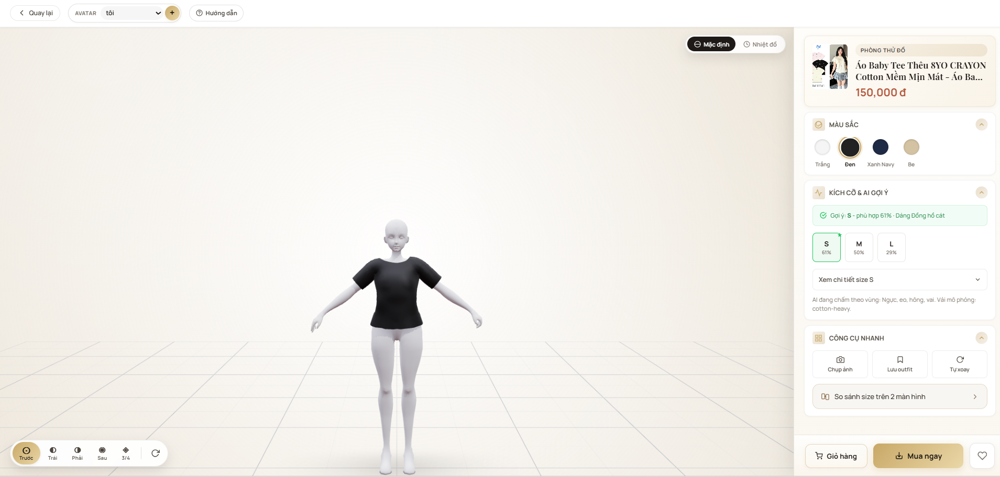
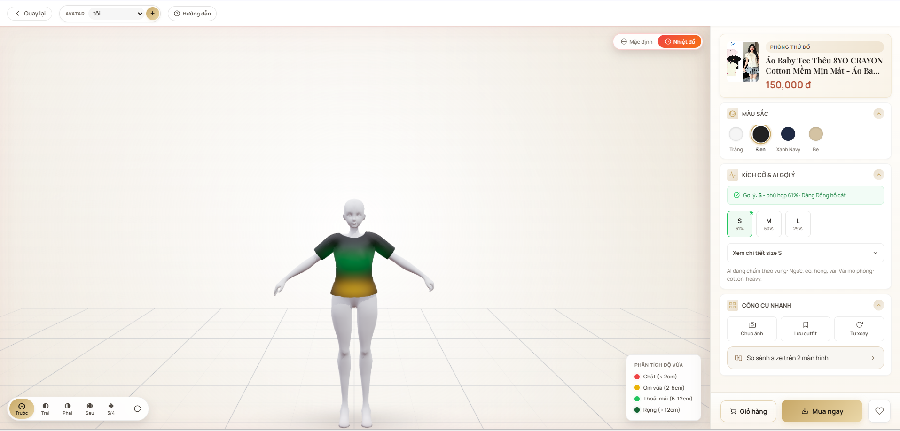
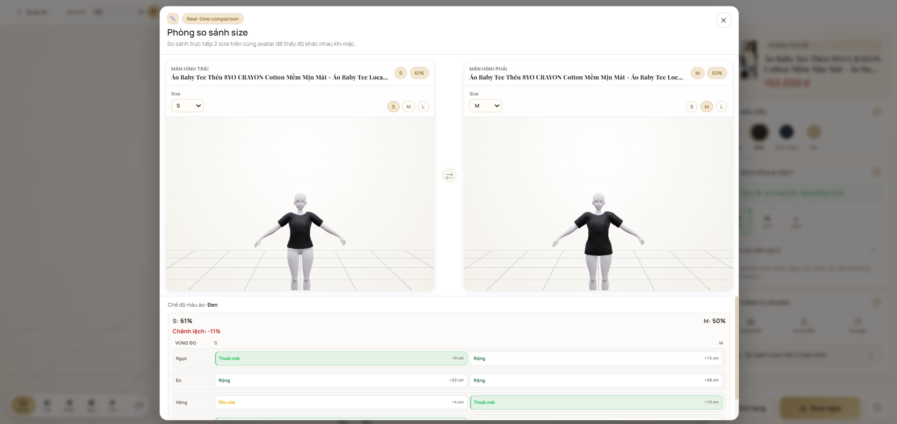
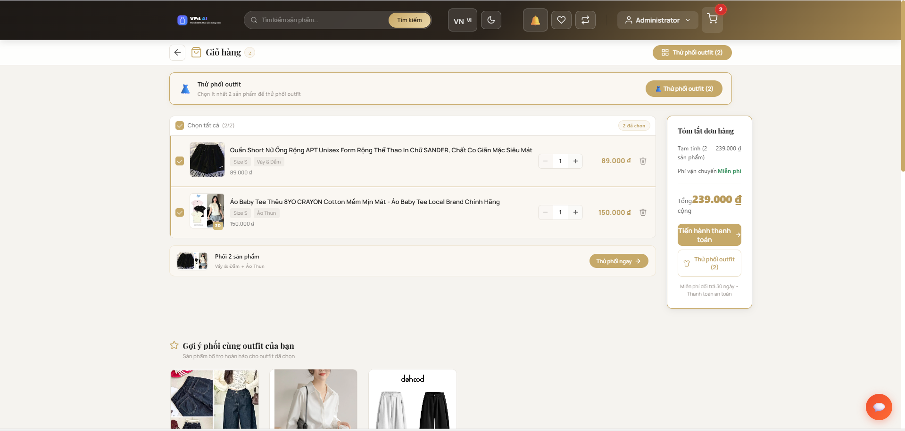
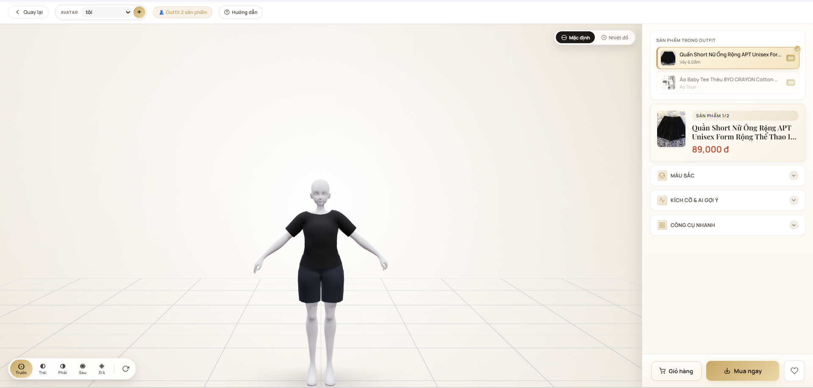
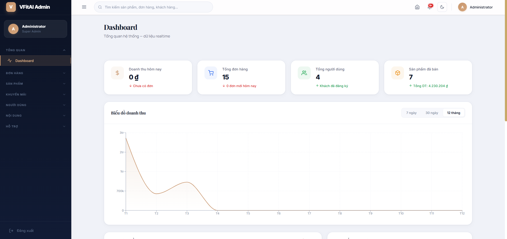

# 👕 VFitAI — Virtual Try-On 3D Platform

**Nền tảng thương mại điện tử thời trang tích hợp công nghệ thử đồ 3D thời gian thực**

[](https://react.dev/)
[](https://threejs.org/)
[](https://www.typescriptlang.org/)
[](https://expressjs.com/)
[](https://www.mongodb.com/atlas)
[](https://vite.dev/)


## 📖 Giới thiệu

### Bối cảnh đề tài

Trong thương mại điện tử thời trang, tỷ lệ đổi trả sản phẩm do **không vừa size** hoặc **khác kỳ vọng** chiếm tới 30-40% tổng đơn hàng. Nguyên nhân chính là người dùng không thể hình dung chính xác sản phẩm sẽ trông như thế nào trên cơ thể mình khi chỉ xem ảnh 2D.

### Giải pháp

**VFitAI** giải quyết vấn đề này bằng cách xây dựng một **phòng thử đồ ảo 3D (Virtual Fitting Room)** tích hợp trực tiếp vào nền tảng thương mại điện tử. Người dùng nhập thông số cơ thể (chiều cao, cân nặng, số đo) → hệ thống tạo **avatar 3D** tương ứng vóc dáng → thử trang phục trong không gian ba chiều với phản hồi **gợi ý size bằng AI** theo thời gian thực.

### Phạm vi đồ án

| Hạng mục | Mô tả |
|----------|-------|
| **Loại đồ án** | Đồ án cơ sở ngành Công nghệ Thông tin |
| **Mô hình phát triển** | Fullstack Monorepo (Client + Server) |
| **Lĩnh vực ứng dụng** | Thương mại điện tử thời trang + Đồ họa 3D Web |
| **Đối tượng người dùng** | Khách hàng mua sắm trực tuyến, Quản trị viên cửa hàng |

---

## 🏗 Kiến trúc hệ thống

```
┌────────────────────────────────────────────────────────┐
│                      CLIENT (SPA)                      │
│  React 19 + TypeScript + Vite 7                        │
│  ┌───────────┐  ┌──────────────┐  ┌──────────────────┐ │
│  │ E-Commerce│  │ Virtual      │  │ Admin            │ │
│  │ Module    │  │ Try-On 3D    │  │ Dashboard        │ │
│  │           │  │ (Three.js)   │  │                  │ │
│  └─────┬─────┘  └──────┬───────┘  └────────┬─────────┘ │
│        └───────────────┼───────────────────┘           │
│                        │ Axios HTTP                    │
└────────────────────────┼───────────────────────────────┘
                         │ REST API
┌────────────────────────┼────────────────────────────────┐
│                   SERVER (API)                          │
│  Node.js + Express 5                                    │
│  ┌──────────┐  ┌───────────┐  ┌─────────────┐           │
│  │ Auth     │  │ Product   │  │ Order       │           │
│  │ (JWT +   │  │ CRUD      │  │ Management  │           │
│  │  bcrypt) │  │           │  │ + Email     │           │
│  └────┬─────┘  └─────┬─────┘  └──────┬──────┘           │
│       └──────────────│───────────────┘                  │
│                      │ Mongoose ODM                     │
└──────────────────────┼──────────────────────────────────┘
                       │
              ┌────────▼─────────┐
              │   MongoDB Atlas  │
              │   (Cloud NoSQL)  │
              └──────────────────┘
```

---

## 🛠 Công nghệ sử dụng

### Frontend

| Công nghệ | Phiên bản | Vai trò |
|-----------|-----------|---------|
| **React** | 19.2.0 | Thư viện xây dựng giao diện SPA |
| **TypeScript** | 5.9.3 | Hệ thống kiểu tĩnh, giảm lỗi runtime |
| **Vite** | 7.2.4 | Build tool — HMR nhanh, tree-shaking |
| **React Router DOM** | 7.12.0 | Định tuyến phía client (SPA routing) |
| **Three.js** | 0.182.0 | Thư viện đồ họa 3D WebGL |
| **React Three Fiber** | 9.5.0 | React renderer cho Three.js |
| **@react-three/drei** | 10.7.7 | Bộ helper cho R3F (OrbitControls, Environment, ...) |
| **Framer Motion** | 12.29.0 | Thư viện animation khai báo |
| **Axios** | 1.13.2 | HTTP client gọi API |
| **Recharts** | 3.7.0 | Biểu đồ thống kê cho Admin Dashboard |
| **Swiper** | 12.0.3 | Carousel/slider responsive |
| **Lucide React** | 0.575.0 | Bộ icon SVG |

### Backend

| Công nghệ | Phiên bản | Vai trò |
|-----------|-----------|---------|
| **Node.js** | 18+ | Runtime JavaScript phía server |
| **Express** | 5.2.1 | Framework xây dựng REST API |
| **Mongoose** | 9.1.3 | ODM cho MongoDB |
| **JWT** | 9.0.3 | Xác thực token-based |
| **bcryptjs** | 3.0.3 | Hash mật khẩu |
| **Nodemailer** | 8.0.1 | Gửi email xác nhận đơn hàng |
| **CORS** | 2.8.5 | Xử lý Cross-Origin requests |

### Cơ sở dữ liệu

| Công nghệ | Chi tiết |
|-----------|----------|
| **MongoDB Atlas** | Cloud NoSQL — lưu trữ sản phẩm, người dùng, đơn hàng |

### Công cụ phát triển

| Công cụ | Mục đích |
|---------|----------|
| **Git & GitHub** | Quản lý mã nguồn |
| **VS Code** | IDE phát triển |
| **ESLint** | Kiểm tra chất lượng code |
| **Blender** | Tạo & chỉnh sửa mô hình 3D (.glb) |

---

## 🚀 Tính năng chi tiết

### 1. Phòng thử đồ 3D — Virtual Try-On ⭐ *Trọng tâm đồ án*

Đây là module cốt lõi, mô phỏng trải nghiệm thử quần áo trong không gian 3D.

| Tính năng | Mô tả |
|----------|-------|
| **Avatar Studio** | Tạo nhân vật 3D từ thông số cơ thể (chiều cao, cân nặng, số đo ngực/eo/hông) |
| **Body Morphing** | Tự động biến đổi mesh avatar theo thông số — sử dụng Morph Targets (Blend Shapes) |
| **Body Presets** | Chọn nhanh kiểu dáng cơ thể (Đồng hồ cát, Chữ nhật, ...) |
| **Garment Binding** | Gắn trang phục 3D lên khung xương avatar — xử lý skinning, skeleton binding |
| **Multi-Layer Outfit** | Thử nhiều trang phục cùng lúc (áo + quần) với hệ thống layer |
| **Fabric Simulation** | Mô phỏng chất liệu vải (cotton, silk, denim) thông qua PBR Material tuning |
| **Size Recommendation (AI)** | Phân tích khoảng cách (ease) giữa số đo cơ thể và garment size specs → gợi ý size phù hợp nhất kèm điểm phần trăm |
| **Heatmap Fit Analysis** | Hiển thị bản đồ nhiệt trên trang phục: vùng chật (đỏ), vừa (xanh lá), rộng (xanh dương) |
| **Camera Controls** | 5 góc nhìn preset (Trước, Trái, Phải, Sau, 3/4) + xoay tự do + tự động xoay |
| **Screenshot Export** | Chụp ảnh avatar đã thử đồ để lưu hoặc chia sẻ |
| **Size Compare Room** | So sánh 2 size song song trên 2 màn hình 3D |

#### Quy trình hoạt động

```
Người dùng nhập thông số cơ thể
        │
        ▼
Avatar 3D được tạo (Morph Targets)
        │
        ▼
Chọn sản phẩm → Load mô hình .glb
        │
        ▼
Garment binding lên skeleton avatar
        │
        ▼
Chọn size + màu sắc
        │
        ▼
AI phân tích ease → Gợi ý size + Heatmap
        │
        ▼
Xem 3D / Chụp ảnh / Thêm giỏ hàng
```

### 2. Thương mại điện tử

| Tính năng | Mô tả |
|----------|-------|
| **Danh mục sản phẩm** | Phân loại theo category, tìm kiếm, lọc |
| **Chi tiết sản phẩm** | Thông tin, ảnh, đánh giá, sản phẩm liên quan |
| **Giỏ hàng** | Thêm/sửa/xoá sản phẩm, lưu localStorage + đồng bộ server |
| **Thanh toán** | Quy trình multi-step: thông tin → vận chuyển → thanh toán → xác nhận |
| **Phương thức thanh toán** | COD, Chuyển khoản, MoMo, ZaloPay, VNPAY, Visa/MasterCard |
| **Đơn hàng** | Theo dõi trạng thái (Chờ xử lý → Đang giao → Đã giao), huỷ đơn |
| **Email xác nhận** | Gửi email HTML khi đặt hàng thành công (Nodemailer) |
| **Đánh giá sản phẩm** | Hệ thống 5 sao + bình luận + ảnh đính kèm |
| **Wishlist** | Danh sách yêu thích, đồng bộ server |
| **So sánh sản phẩm** | So sánh thông số song song |
| **Gợi ý sản phẩm** | Dựa trên lịch sử xem, category, và sản phẩm bán chạy |

### 3. Khuyến mãi & Tương tác

| Tính năng | Mô tả |
|----------|-------|
| **Flash Sale** | Đếm ngược thời gian, giới hạn số lượng |
| **Voucher & Mã giảm giá** | Áp dụng khi thanh toán, theo dõi sử dụng per-user |
| **Vòng quay may mắn** | Gamification — quay trúng voucher giảm giá |
| **Newsletter** | Đăng ký email nhận mã giảm 10% |
| **Chat hỗ trợ** | Chatbot tự động trả lời FAQ + Admin trả lời trực tiếp |
| **Thông báo realtime** | Cập nhật đơn hàng, khuyến mãi, hệ thống (tối đa 50 mục) |

### 4. Quản trị (Admin Panel)

| Trang | Chức năng |
|-------|-----------|
| **Dashboard** | Thống kê tổng quan: doanh thu, đơn hàng, sản phẩm, biểu đồ (Recharts) |
| **Quản lý sản phẩm** | CRUD sản phẩm, chuẩn hoá ID |
| **Quản lý danh mục** | CRUD danh mục sản phẩm |
| **Quản lý đơn hàng** | Cập nhật trạng thái, xem chi tiết |
| **Quản lý mã giảm giá** | Tạo/sửa/xoá coupon |
| **Quản lý Flash Sale** | Thiết lập sự kiện giảm giá theo thời gian |
| **Chat hỗ trợ** | Trả lời tin nhắn khách hàng, quản lý hội thoại |
| **Đồng bộ dữ liệu** | Sync dữ liệu giữa client và server |

### 5. Trải nghiệm người dùng (UX)

| Tính năng | Chi tiết |
|----------|---------|
| **Đa ngôn ngữ** | LanguageContext — chuyển đổi ngôn ngữ |
| **Dark Mode** | ThemeContext — giao diện sáng/tối |
| **Responsive** | Hỗ trợ Desktop, Tablet, Mobile (breakpoints: 900px, 640px) |
| **Loading Skeleton** | Hiệu ứng loading mượt mà khi tải dữ liệu |
| **Toast Notification** | Phản hồi hành động người dùng |

---

## 📂 Cấu trúc thư mục

```
Virtual-Try-On/
│
├── client/                          # Frontend Application
│   ├── public/
│   │   └── models/                  # Mô hình 3D (.glb)
│   ├── src/
│   │   ├── App.tsx                  # Router chính
│   │   ├── main.tsx                 # Entry point
│   │   │
│   │   ├── features/
│   │   │   └── virtual-tryon/       # Module Virtual Try-On
│   │   │       ├── VirtualTryOn.tsx         # Component chính phòng thử đồ
│   │   │       ├── VirtualTryOn.css         # Styles 
│   │   │       ├── GarmentModel.tsx         # Render & bind trang phục 3D
│   │   │       ├── garmentBinding.ts        # Skeleton binding, fabric, heatmap
│   │   │       └── components/
│   │   │           ├── SizeRecommendation.tsx   # AI gợi ý size
│   │   │           ├── CameraPresets.tsx         # Điều khiển góc camera
│   │   │           ├── BodyEditorDrawer.tsx      # Chỉnh sửa body
│   │   │           ├── BodyPresets.tsx           # Preset dáng người
│   │   │           ├── ProductOptions.tsx        # Chọn size, màu, layer sản phẩm
│   │   │           └── CustomSlider.tsx          # Thanh trượt tùy chỉnh
│   │   │
│   │   ├── pages/                   # trang giao diện
│   │   │   ├── HomePage.jsx
│   │   │   ├── ProductDetailPage.jsx
│   │   │   ├── CartPage.tsx
│   │   │   ├── CheckoutPage.jsx
│   │   │   ├── AvatarStudioPage.tsx
│   │   │   └── ...
│   │   │
│   │   ├── components/              # component tái sử dụng
│   │   │   ├── Header.jsx
│   │   │   ├── ChatWidget.jsx
│   │   │   ├── AuthModal.jsx
│   │   │   └── ...
│   │   │
│   │   ├── contexts/                # Context Providers
│   │   │   ├── AuthContext.jsx
│   │   │   ├── FittingRoomContext.tsx
│   │   │   ├── WishlistContext.jsx
│   │   │   ├── CompareContext.jsx
│   │   │   ├── LanguageContext.jsx
│   │   │   └── ThemeContext.jsx
│   │   │
│   │   ├── admin/                   # Admin Panel
│   │   │   ├── pages/               # Dashboard, Products, Orders, ...
│   │   │   ├── components/          # DataTable, StatCard, ...
│   │   │   └── layout/              # AdminLayout
│   │   │
│   │   ├── data/                    # Dữ liệu cấu hình
│   │   │   ├── initialData.ts       # Sản phẩm mặc định
│   │   │   ├── ThreeDConfig.js      # Cấu hình mô hình 3D
│   │   │   └── vietnamAddress.js    # Dữ liệu địa chỉ VN
│   │   │
│   │   └── three/                   # Utilities Three.js
│   │
│   ├── package.json
│   ├── vite.config.ts
│   └── tsconfig.json
│
├── server/                          # Backend API
│   ├── index.js                     # Express server + tất cả routes
│   └── package.json
│
└── README.md
```

---

## ⚙️ Cài đặt & Triển khai

### Yêu cầu hệ thống

| Yêu cầu | Phiên bản tối thiểu |
|----------|---------------------|
| **Node.js** | 18.0 trở lên |
| **npm** | 9.0 trở lên |
| **Trình duyệt** | Chrome/Edge/Firefox (hỗ trợ WebGL 2.0) |
| **MongoDB** | Atlas Cloud hoặc Local 6.0+ |

### Cài đặt

**1. Clone repository**

```bash
git clone https://github.com/htrsng/Virtual-Try-On.git
cd Virtual-Try-On
```

**2. Khởi chạy Backend**

```bash
cd server
npm install
node index.js
```

Server khởi động tại `http://localhost:3000`

**3. Khởi chạy Frontend**

```bash
# Mở terminal mới
cd client
npm install
npm run dev
```

Ứng dụng mở tại `http://localhost:5173`

Mặc định frontend gọi API tại `http://localhost:3000` (qua `VITE_API_URL` hoặc fallback hardcoded ở một số module).

### Biến môi trường (khuyến nghị)

**Client (`client/.env`)**

```bash
VITE_API_URL=http://localhost:3000
```

**Server (`server/.env`)**

```bash
PORT=3000
MONGODB_URI=<your_mongodb_connection_string>
JWT_SECRET=<your_jwt_secret>
EMAIL_USER=<your_email>
EMAIL_PASS=<your_app_password>
```

Lưu ý: hiện một số cấu hình server đang để trực tiếp trong `server/index.js`; nên chuyển sang `.env` trước khi deploy production.

### Scripts

| Lệnh | Mô tả |
|-------|-------|
| `npm run dev` | Chạy development server (HMR) |
| `npm run build` | Build production (`tsc -b && vite build`) |
| `npm run preview` | Preview bản build production |
| `npm run lint` | Kiểm tra code với ESLint |

---

## 📡 API Endpoints

### Xác thực (`/api/auth`)

| Method | Endpoint | Mô tả |
|--------|----------|-------|
| POST | `/api/auth/register` | Đăng ký tài khoản |
| POST | `/api/auth/login` | Đăng nhập (trả JWT) |
| GET | `/api/auth/me` | Lấy thông tin user hiện tại |
| PUT | `/api/auth/profile` | Cập nhật profile |
| POST | `/api/auth/create-admin` | Tạo tài khoản admin |

### Sản phẩm (`/api/products`)

| Method | Endpoint | Mô tả |
|--------|----------|-------|
| GET | `/api/products` | Lấy danh sách sản phẩm |
| GET | `/api/products/:id` | Chi tiết sản phẩm |
| POST | `/api/products` | Thêm sản phẩm (Admin) |
| PUT | `/api/products/:id` | Sửa sản phẩm (Admin) |
| DELETE | `/api/products/:id` | Xoá sản phẩm (Admin) |

### Đơn hàng (`/api/orders`)

| Method | Endpoint | Mô tả |
|--------|----------|-------|
| POST | `/api/orders` | Tạo đơn hàng mới |
| GET | `/api/orders/my-orders` | Lấy đơn hàng của user |
| GET | `/api/orders` | Tất cả đơn hàng (Admin) |
| PUT | `/api/orders/:id` | Cập nhật trạng thái |
| PUT | `/api/orders/:id/cancel` | Huỷ đơn hàng |
| DELETE | `/api/orders/:id` | Xoá đơn hàng |

### Người dùng (`/api/users`)

| Method | Endpoint | Mô tả |
|--------|----------|-------|
| GET | `/api/users` | Danh sách users (Admin) |
| PUT | `/api/users/:id` | Cập nhật user (Admin) |
| DELETE | `/api/users/:id` | Xoá user (Admin) |

### Khuyến mãi

| Method | Endpoint | Mô tả |
|--------|----------|-------|
| POST | `/api/newsletter/subscribe` | Đăng ký newsletter |
| POST | `/api/newsletter/validate-coupon` | Kiểm tra mã giảm giá |
| POST | `/api/newsletter/use-coupon` | Sử dụng mã giảm giá |

---

## 📸 Ảnh chụp màn hình

<table>
        <tr>
                <td align="center">
                        <strong>home-page</strong><br/>
                        
                </td>
                <td align="center">
                        <strong>product-list</strong><br/>
                        
                </td>
                <td align="center">
                        <strong>product-detail</strong><br/>
                        
                </td>
                <td align="center">
                        <strong>avatar-creation</strong><br/>
                        
                </td>
                <td align="center">
                        <strong>virtual-try-on</strong><br/>
                        
                </td>
        </tr>
        <tr>
                <td align="center">
                        <strong>size-ai-recommendation</strong><br/>
                        
                </td>
                <td align="center">
                        <strong>size-comparison</strong><br/>
                        
                </td>
                <td align="center">
                        <strong>shopping-cart</strong><br/>
                        
                </td>
                <td align="center">
                        <strong>outfit-builder</strong><br/>
                        
                </td>
                <td align="center">
                        <strong>admin-dashboard</strong><br/>
                        
                </td>
        </tr>
</table>


## 📚 Tài liệu tham khảo

1. React Documentation — [https://react.dev](https://react.dev)
2. Three.js Documentation — [https://threejs.org/docs](https://threejs.org/docs)
3. React Three Fiber — [https://r3f.docs.pmnd.rs](https://r3f.docs.pmnd.rs)
4. Express.js Guide — [https://expressjs.com](https://expressjs.com)
5. MongoDB Manual — [https://www.mongodb.com/docs/manual](https://www.mongodb.com/docs/manual)
6. Vite Documentation — [https://vite.dev/guide](https://vite.dev/guide)

---

## 📝 Ghi chú

- Dự án phục vụ mục đích **học tập và nghiên cứu** trong khuôn khổ đồ án cơ sở ngành CNTT.
- Các tính năng thanh toán (MoMo, ZaloPay, VNPAY) hiện ở chế độ **mô phỏng**, chưa tích hợp API gateway thật.
- Mô hình 3D (.glb) được tạo bằng Blender và tối ưu cho hiển thị realtime trên trình duyệt.
- Database sử dụng MongoDB Atlas (cloud) — không cần cài đặt MongoDB local.

---


**VFitAI** — Đồ án cơ sở ngành Công nghệ Thông tin

