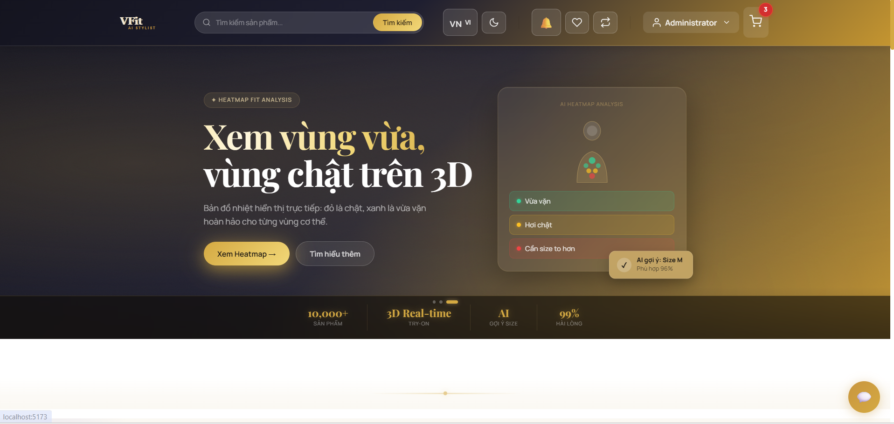
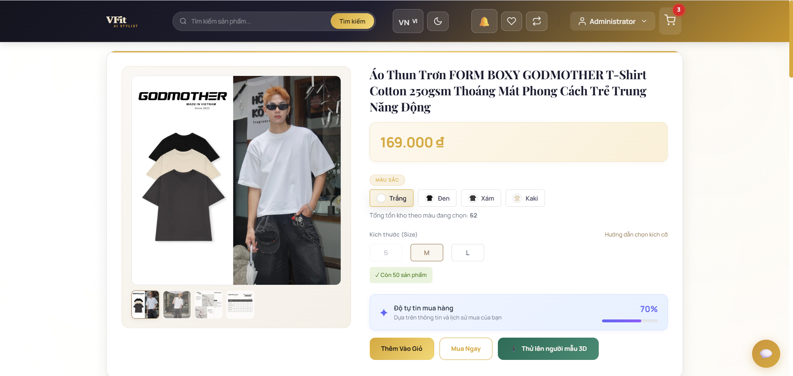
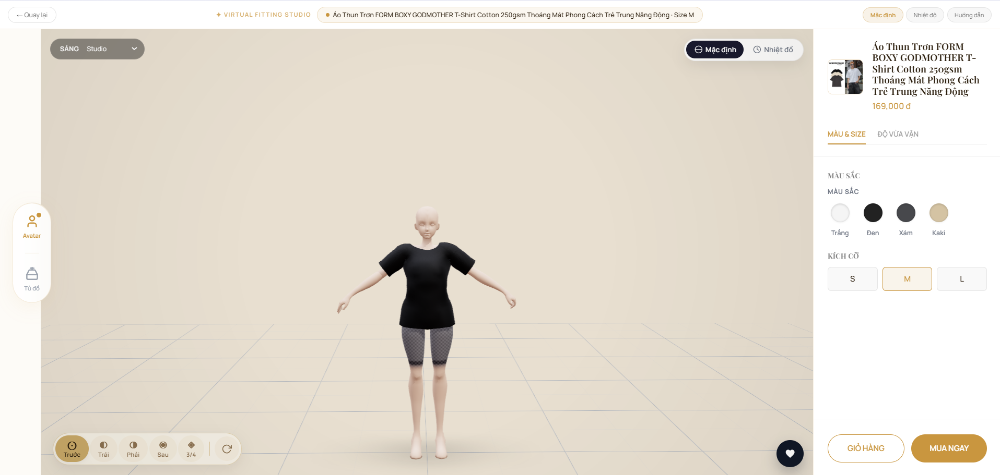
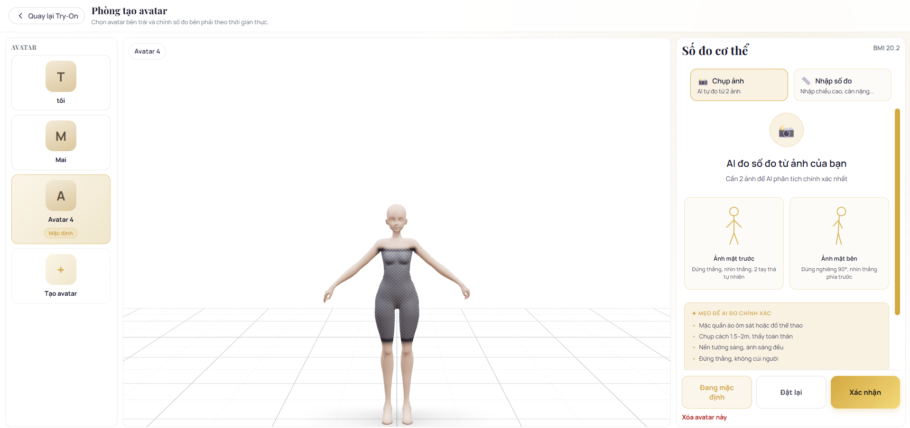
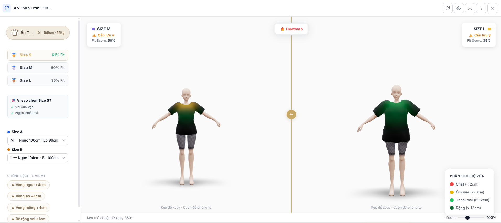
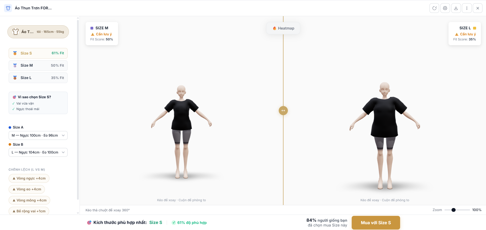
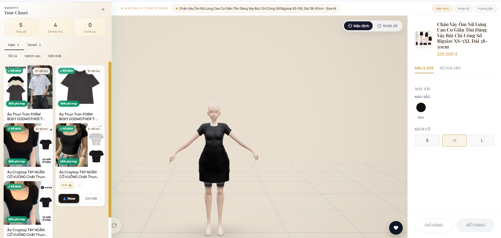
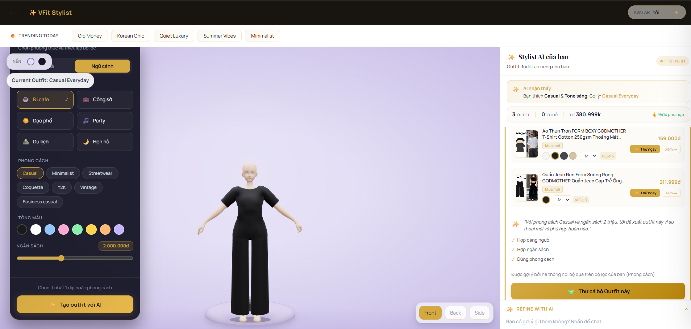
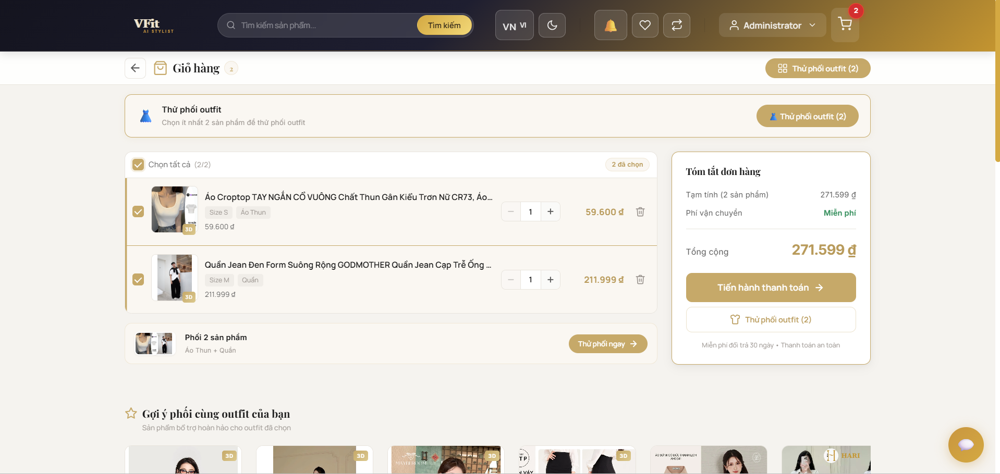

<div align="center">

# 👕 VFitAI — Virtual Try-On & SmartFit 3D Platform

**Nền tảng Thương mại điện tử thời trang tích hợp phòng thử đồ 3D và AI Stylist thời gian thực**


[](https://react.dev/)
[](https://threejs.org/)
[](https://www.typescriptlang.org/)
[](https://expressjs.com/)
[](https://www.mongodb.com/atlas)
[](https://vite.dev/)
[](https://opensource.org/licenses/MIT)
[](https://github.com/htrsng/Virtual-Try-On/actions)

</div>

---

## 📖 Giới thiệu

> **Elevator Pitch:** VFitAI giải quyết bài toán lớn nhất của thời trang trực tuyến — "mua nhưng không biết mặc lên có hợp không". Bằng cách số hóa 3D hình thể người dùng và quần áo, chúng tôi cung cấp phòng thử đồ ảo chân thực cùng AI Stylist, giúp giảm tỷ lệ hoàn trả đơn hàng và nâng tầm trải nghiệm mua sắm cá nhân hóa.

### Bối cảnh đề tài
Trong kỷ nguyên thương mại điện tử, tỷ lệ đổi trả các sản phẩm thời trang do **không vừa size**, **phối không hợp** hoặc **khác kỳ vọng** thường chiếm tới 30-40% tổng đơn hàng. Nguyên nhân cốt lõi là người mua không thể hình dung chính xác một sản phẩm sẽ trông như thế nào khi mặc lên cơ thể thực tế, cũng như khó kết hợp với các trang phục mình đang có.

### Giải pháp VFitAI
**VFitAI** mang đến một trải nghiệm mua sắm thế hệ mới bằng cách kết hợp **Phòng thử đồ ảo 3D (Virtual Fitting Room)** và **Trợ lý phối đồ AI (SmartFit Stylist)**. 
Người dùng không chỉ có thể tạo ra **Avatar 3D** với vóc dáng chính xác của mình để ướm thử trang phục đa chiều, mà còn được sở hữu một **Tủ đồ ảo cá nhân (Virtual Closet)**, nơi AI sẽ tính toán và gợi ý cách mix-match hoàn hảo dựa trên kho đồ có sẵn.

### Phạm vi dự án

| Tiêu chí | Mô tả |
|----------|-------|
| **Đặc điểm** | Đồ án cơ sở ngành Công nghệ Thông tin (Fullstack Monorepo) |
| **Mô hình** | SPA (Client) + RESTful API (Server) |
| **Lĩnh vực** | Thương mại điện tử, Đồ họa 3D Web, Gợi ý AI (AI Recommendation) |
| **Đối tượng** | Khách mua sắm trực tuyến mong muốn trải nghiệm thời trang cá nhân hóa, Quản trị viên cửa hàng |

---

## 🏗 Kiến trúc Hệ thống

```text
┌────────────────────────────────────────────────────────┐
│                      CLIENT (SPA)                      │
│  React 19 + TypeScript + Vite 7                        │
│  ┌───────────┐  ┌──────────────┐  ┌──────────────────┐ │
│  │ E-Commerce│  │ Virtual      │  │ Admin            │ │
│  │ Module    │  │ Try-On 3D    │  │ Dashboard        │ │
│  │           │  │ & AI Stylist │  │                  │ │
│  └─────┬─────┘  └──────┬───────┘  └────────┬─────────┘ │
│        └───────────────┼───────────────────┘           │
│                        │ Axios / Fetch                │
└────────────────────────┼───────────────────────────────┘
                         │ REST API
┌────────────────────────┼────────────────────────────────┐
│                   SERVER (API)                          │
│  Node.js + Express 5                                    │
│  ┌──────────┐  ┌───────────┐  ┌─────────────┐           │
│  │ Auth/User│  │ Product & │  │ Order &     │           │
│  │ Module   │  │ Closet    │  │ Outfit      │           │
│  └────┬─────┘  └─────┬─────┘  └──────┬──────┘           │
│       └──────────────│───────────────┘                  │
│                      │ Mongoose ODM                     │
└──────────────────────┼──────────────────────────────────┘
                       │
              ┌────────▼─────────┐
              │   MongoDB Atlas  │
              │   (Cloud NoSQL)   │
              └──────────────────┘
```

---

## Tổng quan

VFitAI giải quyết bài toán mua sắm thời trang trực tuyến: người dùng không biết món đồ sẽ lên form như thế nào, có vừa size hay không, và có hợp với những món đang có hay không. Dự án kết hợp phòng thử đồ 3D, gợi ý size, AI phối đồ và hệ thống mua sắm đầy đủ để tạo trải nghiệm cá nhân hóa hơn.

### Mục tiêu chính
- Mô phỏng avatar 3D dựa trên số đo người dùng.
- Cho phép thử trang phục và so sánh size trực quan.
- Gợi ý outfit, color matching và set đồ từ AI.
- Hỗ trợ quy trình e-commerce, đơn hàng, thanh toán và admin dashboard.

### Phạm vi

| Hạng mục | Mô tả |
| --- | --- |
| Kiểu dự án | Fullstack monorepo |
| Frontend | SPA với React + TypeScript + Vite |
| Backend | REST API với Node.js + Express |
| Database | MongoDB Atlas / MongoDB local |
| Đối tượng | Khách mua sắm và quản trị viên |

---

## Tính Năng Nổi Bật

### Virtual Try-On 3D
- Tạo avatar 3D từ chiều cao, cân nặng và số đo cơ thể.
- Hỗ trợ thử nhiều lớp trang phục trong cùng một trải nghiệm.
- Hiển thị heatmap và gợi ý size theo mức độ vừa vặn.
- So sánh hai size cạnh nhau trong chế độ split-screen.

### SmartFit AI Stylist
- Gợi ý outfit theo sản phẩm đang xem và tủ đồ cá nhân.
- Tính match score dựa trên kiểu dáng, chất liệu và màu sắc.
- Lưu outfit yêu thích và theo dõi số lần mặc.
- Có cơ chế fallback nội bộ khi AI Gemini không sẵn sàng.

### E-Commerce Core
- Danh mục sản phẩm, tìm kiếm, giỏ hàng, thanh toán nhiều bước.
- Theo dõi đơn hàng, wishlist, review và chat hỗ trợ.
- Email xác nhận đơn hàng qua Nodemailer.
- Flash sale, newsletter và các luồng ưu đãi.

### Admin Dashboard
- Quản lý sản phẩm, đơn hàng, người dùng, banner và khuyến mãi.
- Biểu đồ thống kê doanh thu và dữ liệu hoạt động.
- Đồng bộ dữ liệu giữa frontend và backend.

---

## Công Nghệ Sử Dụng

### Client
- React 19.2, TypeScript 5.9, Vite 7.2
- Three.js, React Three Fiber, @react-three/drei
- Framer Motion, Swiper, Lucide React, React Icons
- Axios, React Router DOM 7.12, Recharts

### Server
- Node.js, Express 5.2
- MongoDB, Mongoose 9.1
- JWT, bcryptjs, CORS
- Nodemailer, Google Generative AI

---

## Cấu Trúc Repo

```text
Virtual-Try-On/
├── client/
│   ├── public/
│   │   └── models/            # Tài nguyên 3D (.glb)
│   ├── src/
│   │   ├── features/          # Virtual try-on, AI stylist, closet
│   │   ├── pages/             # Trang chính
│   │   ├── components/        # Component dùng chung
│   │   ├── contexts/          # State providers
│   │   ├── admin/             # Admin dashboard
│   │   ├── data/              # Data tĩnh và cấu hình
│   │   └── styles/            # CSS
│   └── package.json
├── server/
│   ├── index.js               # API entrypoint
│   ├── config/
│   ├── routes/
│   ├── services.js
│   └── package.json
├── doc/
│   └── Screenshots/
└── README.md
```

---

## Yêu Cầu Hệ Thống

- Node.js 18+
- npm 9+
- Trình duyệt hỗ trợ WebGL 2.0
- MongoDB Atlas hoặc MongoDB local

---

## Chạy Dự Án Local

### 1. Clone repo

```bash
git clone https://github.com/htrsng/Virtual-Try-On.git
cd Virtual-Try-On
```

### 2. Chạy server

```bash
cd server
npm install
```

Tạo file `.env` trong thư mục `server/` với các biến sau:

```env
PORT=3000
MONGODB_URI=mongodb+srv://<username>:<password>@cluster.mongodb.net/vfitai
JWT_SECRET=your_secret_key_here
GEMINI_API_KEY=your_gemini_key_here
EMAIL_USER=your_email@gmail.com
EMAIL_PASS=your_app_password
```

Khởi động server bằng:

```bash
node index.js
```

Server mặc định chạy tại `http://localhost:3000`.

### 3. Chạy client

```bash
cd client
npm install
```

Tạo file `.env` trong thư mục `client/`:

```env
VITE_API_URL=http://localhost:3000
```

Sau đó khởi động frontend:

```bash
npm run dev
```

Ứng dụng sẽ chạy tại `http://localhost:5173`.

### Ghi chú về API proxy

Client đang dùng `VITE_API_URL` cho đa số request. Nếu bạn muốn dùng proxy của Vite thay vì URL tuyệt đối, hãy cập nhật `VITE_API_PROXY_TARGET` cho đúng server đang chạy.

---

## Scripts Hữu Ích

### Client
- `npm run dev`: chạy môi trường phát triển.
- `npm run build`: build production.
- `npm run lint`: kiểm tra ESLint.
- `npm run preview`: xem bản build local.

### Server
- `node index.js`: chạy API.
- `npm run migrate:db`: chạy script migrate dữ liệu.

---

## API Chính

- `POST /api/auth/login`, `POST /api/auth/register`, `GET /api/auth/me`
- `GET /api/products`, `POST /api/products`, `PUT /api/products/:id`
- `GET /api/orders`, `POST /api/orders`, `GET /api/orders/my-orders`
- `GET /api/wishlist`, `POST /api/wishlist/add`
- `POST /api/ai/outfit-suggest`
- `GET /api/notifications`
- `GET /api/admin/*`

---

## Screenshots

Thư mục ảnh minh họa nằm trong `doc/Screenshots/`.

<table>
  <tr>
    <td align="center"><strong>Homepage</strong><br/></td>
    <td align="center"><strong>Product List</strong><br/></td>
    <td align="center"><strong>Virtual Try-On</strong><br/></td>
  </tr>
  <tr>
    <td align="center"><strong>Avatar Creation</strong><br/></td>
    <td align="center"><strong>Heatmap & AI Size</strong><br/></td>
    <td align="center"><strong>Size Compare</strong><br/></td>
  </tr>
  <tr>
    <td align="center"><strong>SmartFit Closet</strong><br/></td>
    <td align="center"><strong>AI Stylist</strong><br/></td>
    <td align="center"><strong>Cart / Mini-Closet</strong><br/></td>
  </tr>
</table>

---

## Roadmap

- Hỗ trợ thêm phụ kiện 3D như kính, mũ, túi và giày.
- Tích hợp AR để thử đồ trực tiếp qua camera điện thoại.
- Nâng cấp AI size recommendation dựa trên computer vision.
- Cải thiện performance cho model 3D dung lượng lớn.

---

## Lưu Ý

- Đây là đồ án phục vụ mục đích nghiên cứu và học tập.
- Cổng thanh toán và một số luồng dịch vụ đang ở chế độ mô phỏng/sandbox.
- Asset 3D được tối ưu riêng để hiển thị tốt trên WebGL.

---

## Tài Liệu Tham Khảo

1. [React Documentation](https://react.dev)
2. [Three.js Docs](https://threejs.org/docs)
3. [React Three Fiber Docs](https://r3f.docs.pmnd.rs)
4. [Express.js Guide](https://expressjs.com)
5. [MongoDB Manual](https://www.mongodb.com/docs/manual)
6. [Vite Guide](https://vite.dev/guide)

---

## Bản Quyền

Dự án được phát triển bởi nhóm sinh viên và phát hành theo giấy phép MIT.

<div align="center">

VFitAI - Định hình tương lai mua sắm thời trang trực tuyến

</div>
