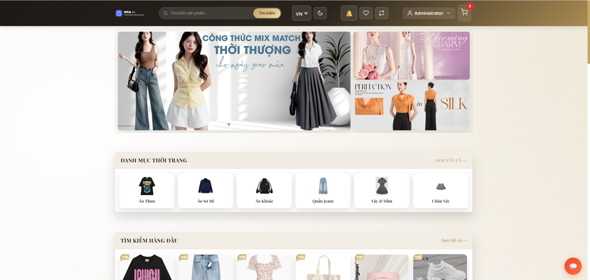
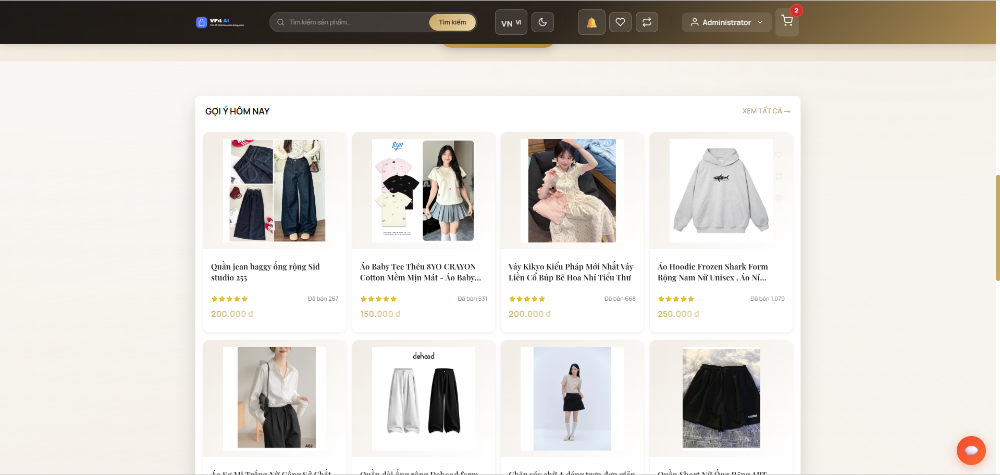
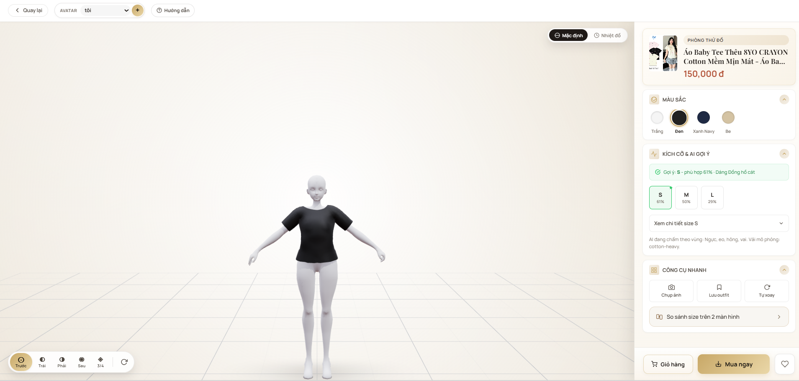
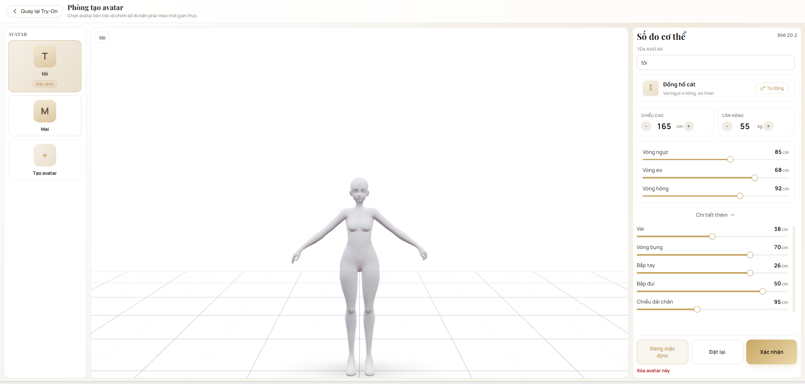
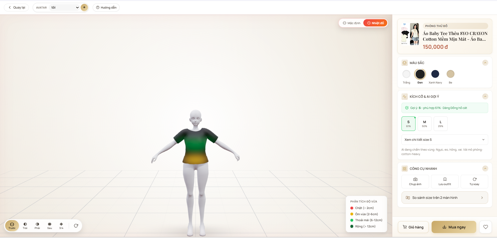
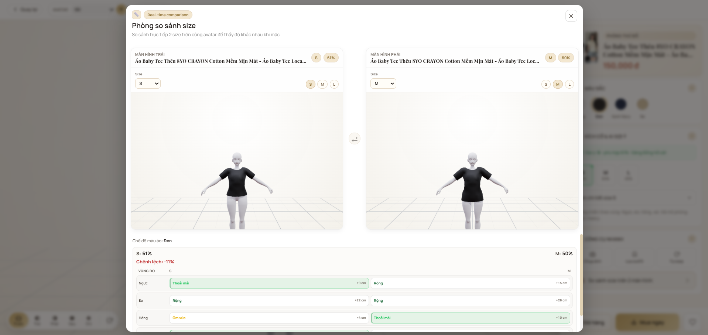
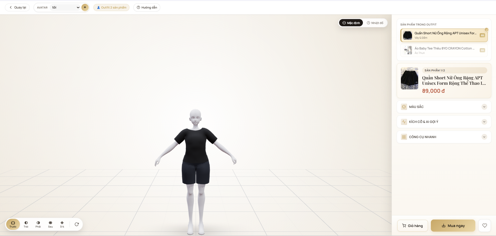
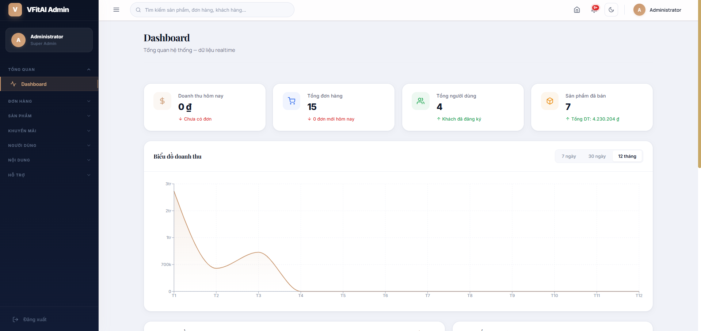

<div align="center">

# 👕 VFitAI — Virtual Try-On & SmartFit 3D Platform

**Nền tảng Thương mại điện tử thời trang tích hợp phòng thử đồ 3D và AI Stylist thời gian thực**

[](https://react.dev/)
[](https://threejs.org/)
[](https://www.typescriptlang.org/)
[](https://expressjs.com/)
[](https://www.mongodb.com/atlas)
[](https://vite.dev/)

</div>

---

## 📖 Giới thiệu

### Bối cảnh đề tài
Trong kỷ nguyên thương mại điện tử, tỷ lệ đổi trả các sản phẩm thời trang do **không vừa size**, **phối không hợp** hoặc **khác kỳ vọng** thường chiếm tới 30-40% tổng đơn hàng. Nguyên nhân cốt lõi là người mua không thể hình dung chính xác một sản phẩm sẽ trông như thế nào khi mặc lên cơ thể thực tế, cũng như khó kết hợp với các trang phục mình đang có.

### Giải pháp VFitAI
**VFitAI** mang đến một trải nghiệm mua sắm thế hệ mới bằng cách kết hợp **Phòng thử đồ ảo 3D (Virtual Fitting Room)** và **Trợ lý phối đồ AI (SmartFit Stylist)**. 
Người dùng không chỉ có thể tạo ra **Avatar 3D** với vóc dáng chính xác của mình để ướm thử trang phục đa chiều, mà còn được sở hữu một **Tủ đồ ảo cá nhân (Virtual Closet)**, nơi AI sẽ tính toán và gợi ý cách mix-match hoàn hảo dựa trên kho đồ có sẵn.

### Phạm vi dự án

| Tiêu chí | Mô tả |
|----------|-------|
| **Đặc điểm** | Đồ án cơ sở ngành Công nghệ Thông tin (Fullstack Monorepo) |
| **Mô hình** | SPA (Client) + RESTful API (Server) |
| **Lĩnh vực** | Thương mại điện tử, Đồ họa 3D Web, Gợi ý AI (AI Recommendation) |
| **Đối tượng** | Khách mua sắm trực tuyến mong muốn trải nghiệm thời trang cá nhân hóa, Quản trị viên cửa hàng |

---

## 🏗 Kiến trúc Hệ thống

```text
┌────────────────────────────────────────────────────────┐
│                      CLIENT (SPA)                      │
│  React 19 + TypeScript + Vite 7                        │
│  ┌───────────┐  ┌──────────────┐  ┌──────────────────┐ │
│  │ E-Commerce│  │ Virtual      │  │ Admin            │ │
│  │ Module    │  │ Try-On 3D    │  │ Dashboard        │ │
│  │           │  │ & AI Stylist │  │                  │ │
│  └─────┬─────┘  └──────┬───────┘  └────────┬─────────┘ │
│        └───────────────┼───────────────────┘           │
│                        │ Axios HTTP                    │
└────────────────────────┼───────────────────────────────┘
                         │ REST API
┌────────────────────────┼────────────────────────────────┐
│                   SERVER (API)                          │
│  Node.js + Express 5                                    │
│  ┌──────────┐  ┌───────────┐  ┌─────────────┐           │
│  │ Auth/User│  │ Product & │  │ Order &     │           │
│  │ Module   │  │ Closet    │  │ Outfit      │           │
│  └────┬─────┘  └─────┬─────┘  └──────┬──────┘           │
│       └──────────────│───────────────┘                  │
│                      │ Mongoose ODM                     │
└──────────────────────┼──────────────────────────────────┘
                       │
              ┌────────▼─────────┐
              │   MongoDB Atlas  │
              │   (Cloud NoSQL)  │
              └──────────────────┘
```

---

## ✨ Tính năng Nổi bật (Độc quyền)

### 1. 👗 Phòng Thử Đồ 3D (Virtual Try-On Room)
Module cốt lõi, nâng tầm trải nghiệm thử đồ nhờ mô phỏng vật lý 3D tiên tiến trên trình duyệt.

- **Avatar Studio**: Tự động tạo hình nhân vật 3D dựa trên số đo cơ thể người dùng (chiều cao, cân nặng, ngực, eo, hông) qua công nghệ Body Morphing (Blend Shapes).
- **Multi-Layer Garment Binding**: Hỗ trợ ướm thử nhiều lớp trang phục đồng thời (Áo, Quần, Áo khoác ngoài...) thông qua Skeleton Binding.
- **AI Size Recommendation & Heatmap**: Hệ thống AI phân tích độ cử động (ease) để gợi ý size lý tưởng nhất, đồng thời hiển thị bản đồ nhiệt ảo (heatmap) cảnh báo vùng chật (đỏ) hay rộng (xanh).
- **Fabric Simulation & Color Config**: Render chất liệu vải (denim, lụa, thun) chân thực bằng PBR Material. Thay đổi màu sắc realtime theo bảng màu sản phẩm.
- **Size Compare Room**: Chế độ Split-screen cho phép so sánh trực quan hai kích cỡ trên cùng một khung hình.

### 2. 🧠 SmartFit AI Stylist & Tủ Đồ Ảo (Virtual Personal Closet) `[TÍNH NĂNG MỚI]`
Cá nhân hóa tủ đồ và tư vấn phối đồ thông minh.

- **Virtual Personal Closet**: Tủ đồ ảo tự động lưu trữ các món đồ người dùng đã từng thử hoặc đã mua, chia danh mục thông minh (Tops, Bottoms, Outerwear, Dresses).
- **Smart Match Score**: Thuật toán tính điểm phù hợp (Match Score) dựa trên sản phẩm đang xem, kết hợp phân tích các từ khóa chất liệu, kiểu dáng và quy tắc phối hợp trang phục (Ví dụ: Blazer kết hợp cùng Linen).
- **Outfit Builder**: Giao diện kéo thả cho phép lưu các set đồ (Saved Outfits) tâm đắc nhất và "Mặc thử ngay" (Wear Item) chỉ với 1 click.
- **Wear Tracking**: Theo dõi số lần mặc (Worn Count) và thống kê thói quen mix-match của người dùng.

### 3. 🛍️ Thương Mại Điện Tử & Tương Tác
Hệ sinh thái E-Commerce hoàn chỉnh.

- **Shopping Journey**: Từ tìm kiếm, lọc danh mục, giỏ hàng đến thanh toán đa bước.
- **Thanh toán đa dạng**: Hỗ trợ COD, Chuyển khoản ngân hàng, ví điện tử (mô phỏng MoMo, ZaloPay, VNPAY).
- **Đơn hàng & Email**: Theo dõi hành trình đơn, tự động gửi email hóa đơn HTML (Nodemailer).
- **Gamification & Ưu đãi**: Vòng quay may mắn (Lucky Wheel), Flash Sale đếm ngược, đăng ký Newsletter nhận mã giảm giá.
- **Review & Wishlist**: Đánh giá 5 sao kèm hình ảnh, danh sách sản phẩm yêu thích đồng bộ cloud.
- **Chatbot & Live Chat**: Tương tác trực tiếp giải đáp thắc mắc khách hàng.

### 4. ⚙️ Quản Trị Toàn Diện (Admin Dashboard)
- **Thống kê & Biểu đồ**: Thống kê doanh thu, đơn hàng, người dùng qua Recharts.
- **CRUD Operations**: Quản lý chi tiết Sản phẩm, Đơn hàng, Danh mục, Người dùng, Mã giảm giá, và Flash Sale.
- **Data Sync**: Đồng bộ hóa dữ liệu realtime giữa frontend và backend.

---

## 🛠 Công nghệ Sử dụng

### Frontend (Client SPA)
- **Core**: React 19.2, TypeScript 5.9, Vite 7.2
- **3D Graphics**: Three.js 0.182, React Three Fiber (R3F), @react-three/drei
- **UI/UX**: Framer Motion (Animation), Tailwind CSS (tùy chọn styling), Swiper (Carousel), Lucide React (Icons)
- **Data & Network**: Axios, React Router DOM 7.12

### Backend (Server API)
- **Core**: Node.js 18+, Express 5.2
- **Database**: MongoDB Atlas, Mongoose 9.1 (ODM)
- **Security & Auth**: JSON Web Tokens (JWT), bcryptjs
- **Ultilities**: Nodemailer (Email), CORS

---

## 📂 Cấu trúc Thư mục Chính

```text
Virtual-Try-On/
├── client/                     # Frontend Application
│   ├── public/models/          # Kho lưu trữ mô hình 3D (.glb)
│   ├── src/
│   │   ├── features/
│   │   │   └── virtual-tryon/  # Logic cốt lõi: 3D Try-on, AI Stylist, Smart Closet
│   │   ├── pages/              # Các trang chính: Home, Product, Cart, Admin...
│   │   ├── components/         # UI Components dùng chung
│   │   ├── contexts/           # State Management (Auth, FittingRoom, Theme...)
│   │   ├── admin/              # Giao diện Admin Dashboard
│   │   ├── data/               # Dữ liệu tĩnh, cấu hình ThreeDConfig
│   │   └── three/              # Các utilities tùy chỉnh cho Three.js
│   └── package.json            
├── server/                     # Backend API Application
│   ├── index.js                # Entry point & API Routes
│   └── package.json            
└── README.md                   # Tài liệu dự án (bạn đang đọc)
```

---

## ⚙️ Hướng dẫn Cài đặt & Triển khai

### Yêu cầu Hệ thống tối thiểu
- **Node.js**: v18.0+
- **npm**: v9.0+
- **Trình duyệt**: Chrome/Edge/Firefox có hỗ trợ WebGL 2.0
- **MongoDB**: Đã có URI kết nối tới MongoDB Atlas hoặc local.

### Các bước cài đặt

**1. Clone dự án**
```bash
git clone https://github.com/htrsng/Virtual-Try-On.git
cd Virtual-Try-On
```

**2. Thiết lập & Khởi chạy Server (Backend)**
```bash
cd server
npm install

# (Tùy chọn) Tạo file .env và điền các biến như: PORT, MONGODB_URI, JWT_SECRET...

npm start    # hoặc `node index.js`
```
*Server mặc định chạy tại `http://localhost:5000`*

**3. Thiết lập & Khởi chạy Client (Frontend)**
```bash
# Mở một terminal mới
cd client
npm install

# Tạo file .env và cấu hình API URL nếu cần (VD: VITE_API_URL=http://localhost:5000)

npm run dev
```
*Ứng dụng Web sẽ mở tại `http://localhost:5173`*

### Scripts hỗ trợ (Client)
- `npm run dev`: Chạy server phát triển.
- `npm run build`: Biên dịch TypeScript và build Production bundle.
- `npm run lint`: Kiểm tra chất lượng mã nguồn với ESLint.

---

## 📡 API Endpoints (Tóm tắt)

Hệ thống cung cấp RESTful APIs. Một số nhóm API chính:
- **Auth**: `/api/auth/*` (Login, Register, Profile, Admin)
- **Products**: `/api/products/*` (CRUD sản phẩm, danh mục)
- **Orders**: `/api/orders/*` (Tạo đơn, Hủy đơn, Lấy danh sách, Trạng thái)
- **Smart Closet**: `/api/virtual-closet`, `/api/saved-outfits` (Quản lý tủ đồ cá nhân, Outfit)
- **Promotions**: `/api/newsletter/*` (Mã giảm giá, Đăng ký nhận tin)

---

## 📸 Thư viện Ảnh (Screenshots)

*Dưới đây là một số giao diện nổi bật của VFitAI:*

<table>
    <tr>
        <td align="center">
            <strong>Trang chủ (Homepage)</strong><br/>
            
        </td>
        <td align="center">
            <strong>Danh sách Sản phẩm</strong><br/>
            
        </td>
        <td align="center">
            <strong>Phòng Thử Đồ 3D</strong><br/>
            
        </td>
        <td align="center">
            <strong>Tạo Avatar 3D</strong><br/>
            
        </td>
    </tr>
    <tr>
        <td align="center">
            <strong>Heatmap & AI Size</strong><br/>
            
        </td>
        <td align="center">
            <strong>So sánh Kích cỡ (Size Compare)</strong><br/>
            
        </td>
        <td align="center">
            <strong>SmartFit Closet & AI Stylist</strong><br/>
            
        </td>
        <td align="center">
            <strong>Admin Dashboard</strong><br/>
            
        </td>
    </tr>
</table>

---

## 📚 Tài liệu Tham khảo

1. [React 19 Documentation](https://react.dev)
2. [Three.js Manual](https://threejs.org/docs)
3. [React Three Fiber Docs](https://r3f.docs.pmnd.rs)
4. [Express.js Guide](https://expressjs.com)
5. [MongoDB Developer Hub](https://www.mongodb.com/docs/manual)
6. [Vite Tooling](https://vite.dev/guide)

---

## 📝 Ghi chú Đồ án

- Đây là sản phẩm phục vụ **nghiên cứu & học tập** mang tính ứng dụng cao trong khuôn khổ Đồ án.
- Cổng thanh toán (MoMo, VNPAY...) là môi trường giả lập (sandbox/mock).
- Toàn bộ Asset 3D (.glb) được tinh chỉnh riêng lẻ bằng phần mềm Blender để đảm bảo hiển thị mượt mà trên môi trường WebGL.

---

<div align="center">

**VFitAI — Định hình tương lai mua sắm thời trang trực tuyến**

</div>
